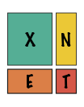

---
---

{: .align-center}

The package `xnet` is a package in development for cross-network analysis
like protein-ligand or plant-pollinator interactions. Currently the
package provides a basic interface for two-step kernel ridge regression,
including quick cross-validation due to algebraic shortcuts.

The package is still in beta, so expect thorough changes and additions. 
The current version can be installed at your own risk using following code:

    devtools::install_github("CenterForStatistics-UGent/xnet") 
    
If you want to download the latest devel version, you can use the following code :

    devtools::install_github("CenterForStatistics-UGent/xnet", ref = "devel) 

    
Keep in mind that the repository structure will change when the package nears completion,
so do NOT use this temporary installation instruction as reference for future installations.

The paper describing the method is currently under review. A preprint is available. 

Stock, M., Pahikkala, T., Airola, A., Waegeman, W. and De Baets, B. *Algebraic shortcuts for leave-one-out cross-validation in supervised network inference* Submitted to a journal. [Preprint](https://www.biorxiv.org/content/early/2018/01/03/242321.1)

Our algorithms are part of a larger kernel-based framework for pairwise learning. A paper relating the different methods and their learning properties was recently accepted for publication in Neural Computation:

Stock, M., Pahikkala, T., Airola, A., De Baets, B. and Waegeman, W. *A comparative study of pairwise learning methods based on kernel ridge regression* Accepted in Neural Computation (2018). [Preprint](https://arxiv.org/abs/1803.01575)
